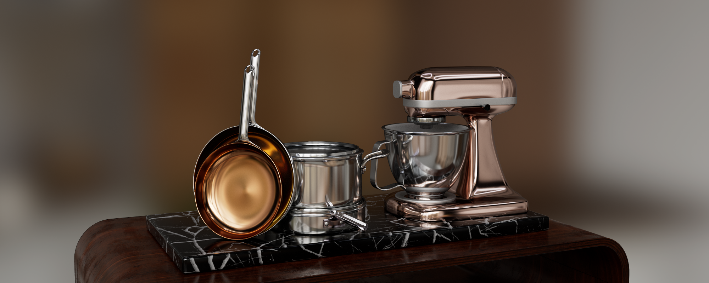
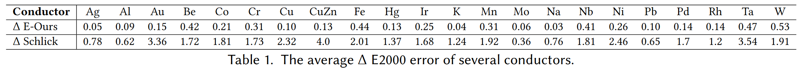
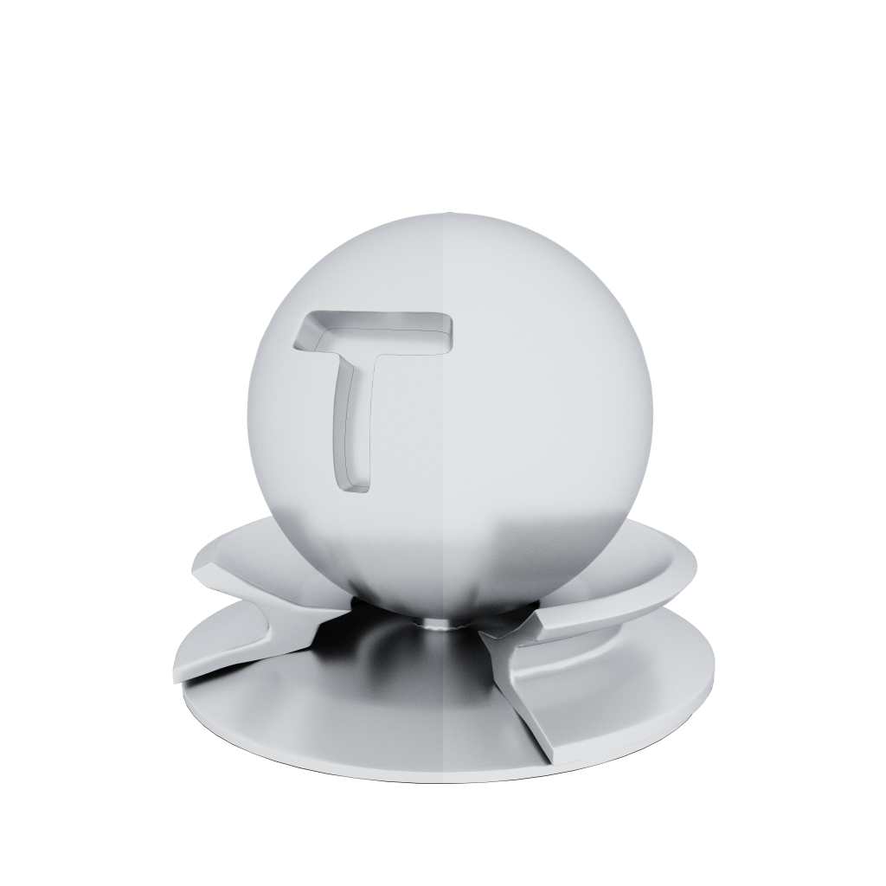
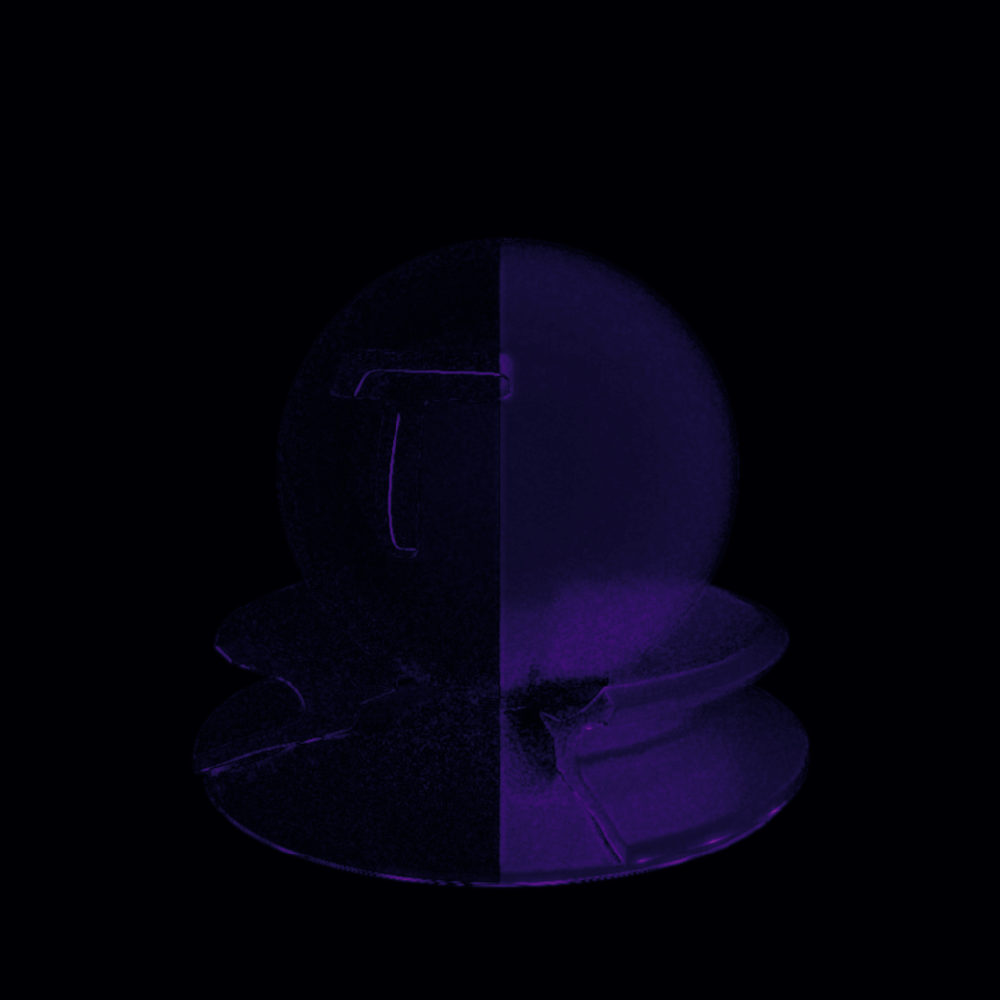
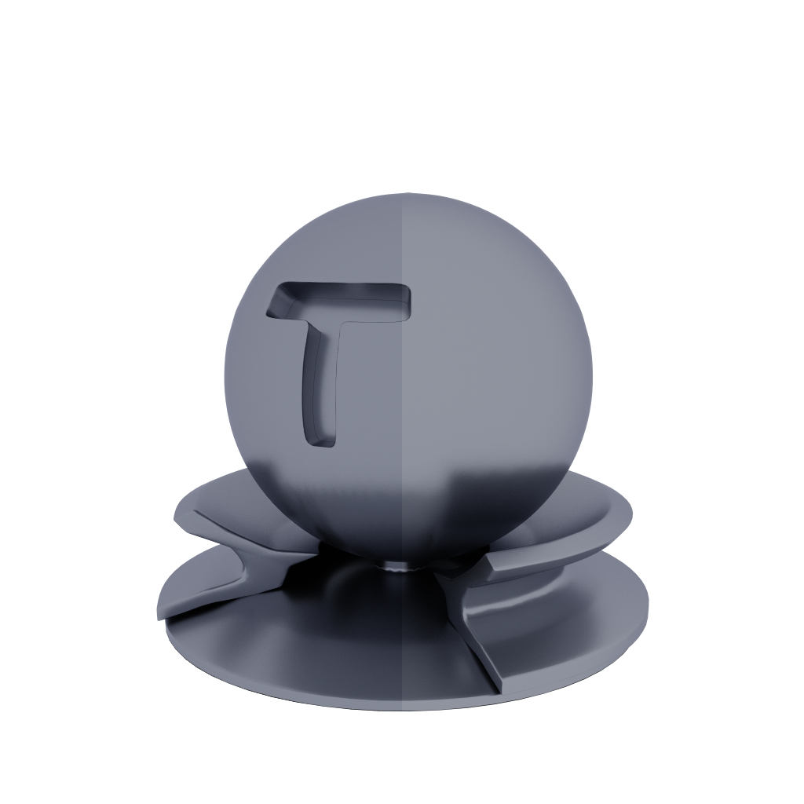
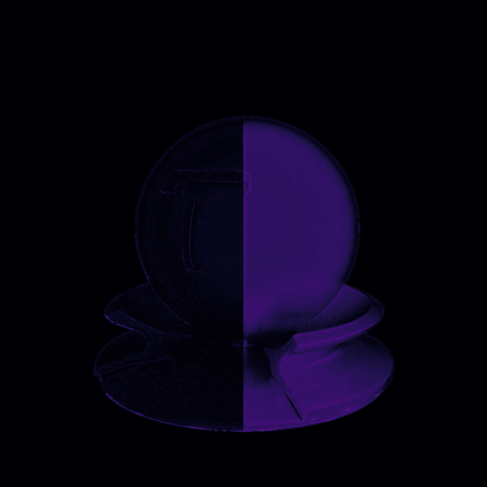
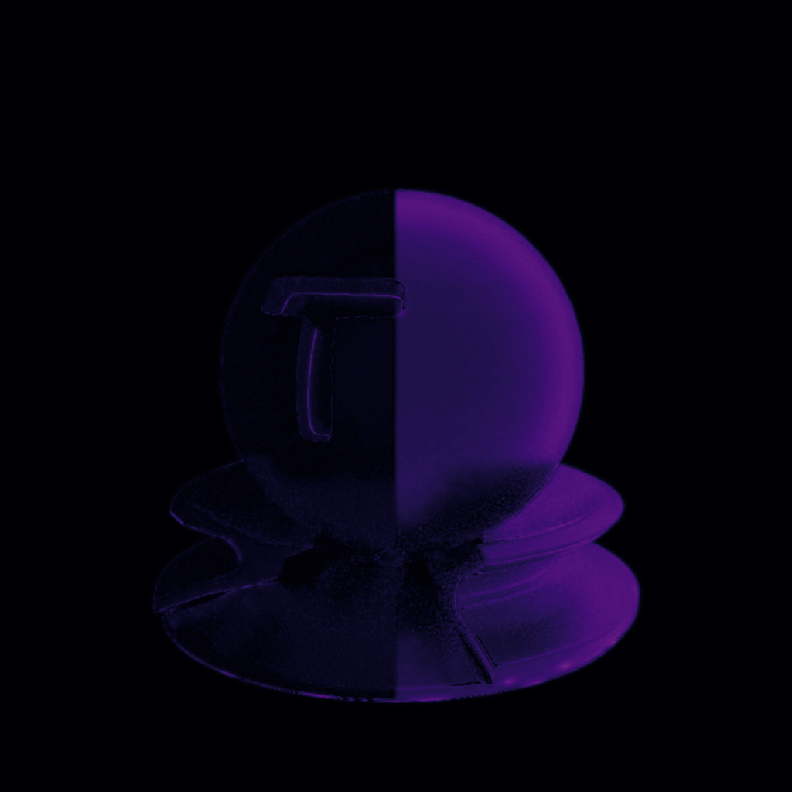
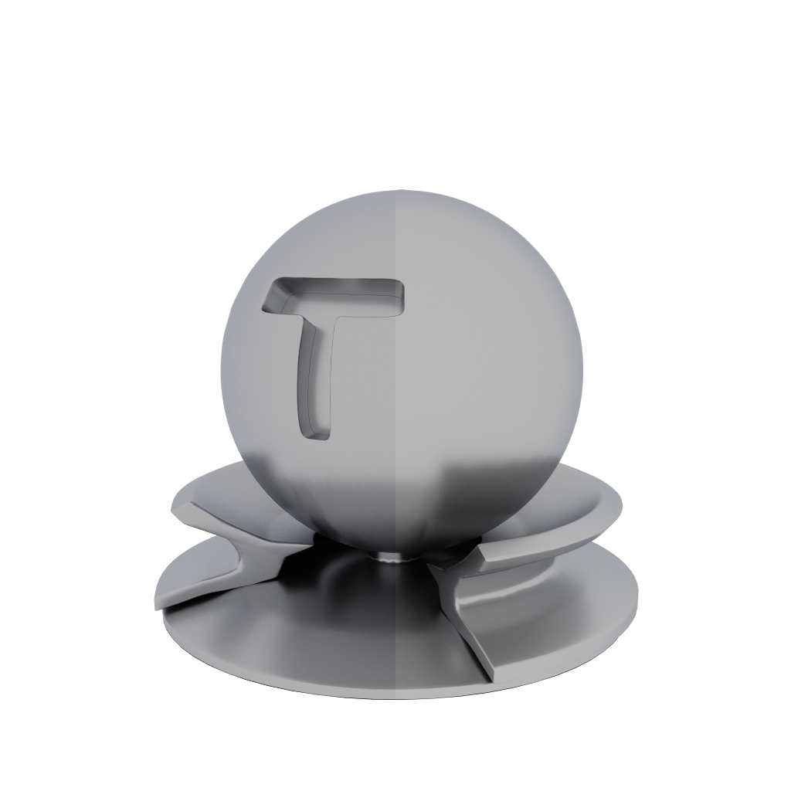
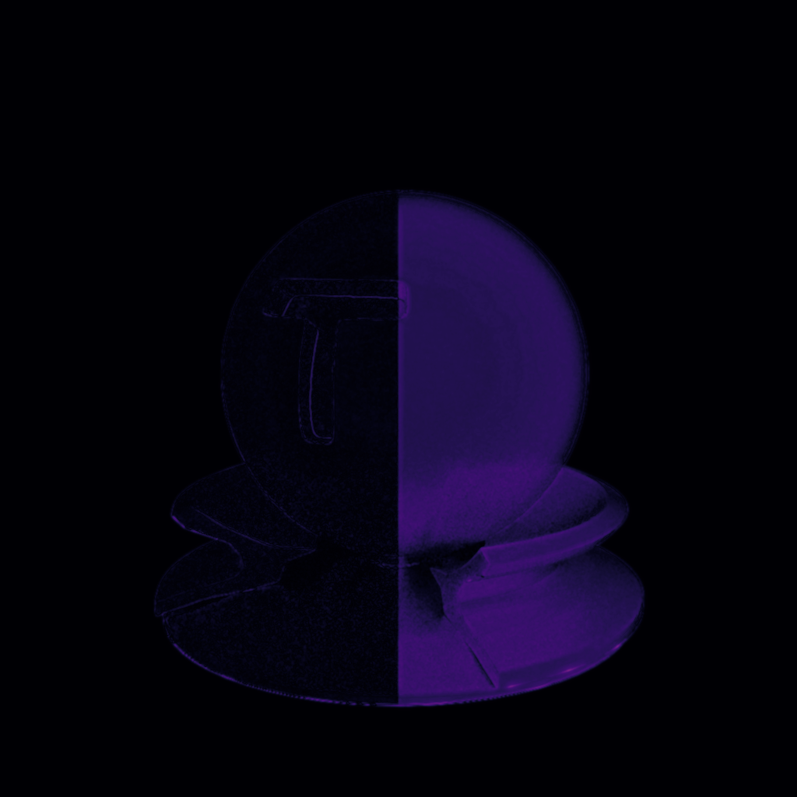
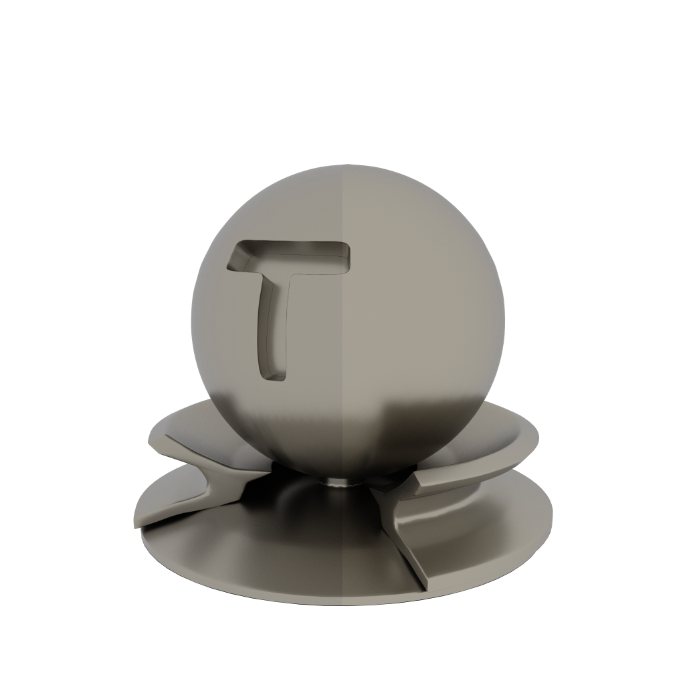

## Abstract
We propose a novel analytical RGB model for rendering coated conductors, which provides improved accuracy of Fresnel reflectance in BRDFs. Our model targets real-time path tracing and approximates the Fresnel reflectance curves with noticeably more accuracy than Schlick's approximation with the error compensation term proposed by Lazányi and Szirmay-Kalos using Hoffman’s notation with the external media adjustment (hereafter referred to as 'adjusted Lazányi approximation'). 

We propose an analytical function with coefficients fitted to measured spectral datasets describing the complex index of refraction for conductors. We utilize second-order polynomials to fit the model, subsequently compressing the fitted coefficients to optimize memory requirements while maintaining quality. Both quantitative and visual results affirm the efficacy of our model in representing the Fresnel reflectance of the tested conductors.

## Results
In the table below we compare average ΔE2000 error measurements, results are taken over all cos theta values with incident IOR values ranging from 1.0 to 2.5. We compare our method against the adjusted Lazányi approximation.  



### Comparisons
In this section we show comparisons between Schlick's approximation and our model, this is a subset of our entire data-set rendered at an incident IOR of 1.5, more comparisons with 22 tested conductors can be found in our supplemental material. On the right side of the slider the FLIP error metric is shown. 

#### Al (Aluminum)
> The left side of each image shows our approximation while the right side shows the adjusted Lazányi approximation.
<div class="horizontal-image-container" width="100%">
    
    
</div>


#### Cr (Chromium)
> The left side of each image shows our approximation while the right side shows the adjusted Lazányi approximation.
<div class="horizontal-image-container" width="100%">
    
    
</div>

#### CuZn (Brass)
> The left side of each image shows our approximation while the right side shows the adjusted Lazányi approximation.
<div class="horizontal-image-container" width="100%">
    
    
</div>

#### Hg (Mercury)
> The left side of each image shows our approximation while the right side shows the adjusted Lazányi approximation.
<div class="horizontal-image-container" width="100%">
    
    
</div>

#### Pd (Palladium)
> The left side of each image shows our approximation while the right side shows the adjusted Lazányi approximation.
<div class="horizontal-image-container" width="100%">
    
    
</div>

## Acknowledgements
We appreciate Jacco Bikker for his invaluable feedback and proofreading. Special thanks to Jasper Bekkers for his exceptional support. We also want to thank Luca Quartesan, Athos van Kralingen, and Yigit Aras Tunali and the rest of the team at Traverse Research for their insightful comments.

## Paper
**A Fresnel Model for Coated Materials**  
Hannes Vernooij
+ [Paper](https://diglib.eg.org/bitstream/handle/10.2312/egs20241028/13_egs20241028.pdf)
+ [BibTeX](assets/vernooij2024-ud.bib)
+ [Code](https://diglib.eg.org/bitstream/handle/10.2312/egs20241028/supplemental-code.zip)
+ [Supplemental material](https://diglib.eg.org/bitstream/handle/10.2312/egs20241028/short1049_supp.pdf)

## Citation
```bibtex
@inproceedings {10.2312:egs.20241028,
booktitle = {Eurographics 2024 - Short Papers},
editor = {Hu, Ruizhen and Charalambous, Panayiotis},
title = {{A Fresnel Model for Coated Materials}},
author = {Vernooij, Hannes B.},
year = {2024},
publisher = {The Eurographics Association},
ISSN = {1017-4656},
ISBN = {978-3-03868-237-0},
DOI = {10.2312/egs.20241028}
}

```

<script src="https://cdn.knightlab.com/libs/horizontal-image-container/latest/js/horizontal-image-container.min.js"></script>
<link rel="stylesheet" href="https://cdn.knightlab.com/libs/horizontal-image-container/latest/css/horizontal-image-container.css">
